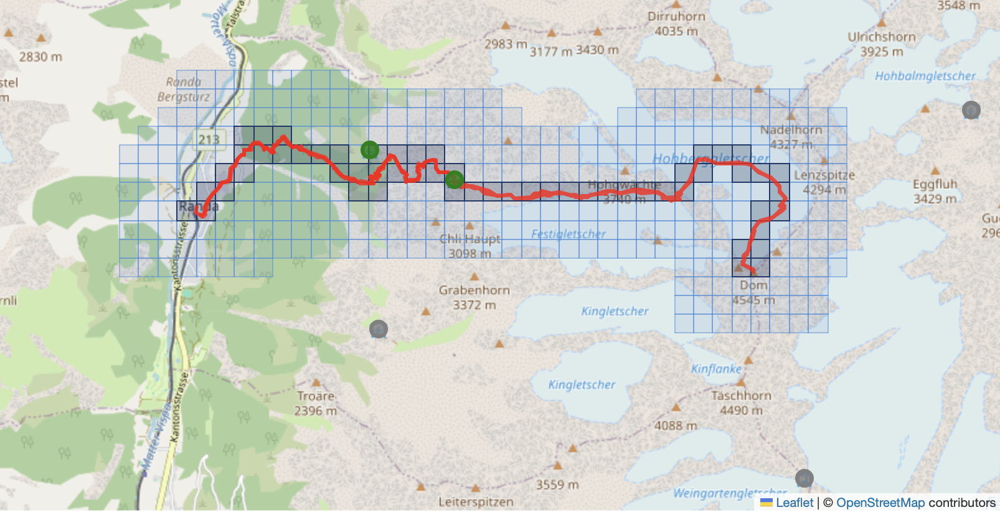

waykit
======

waykit is a python tool to generate location metatata like peaks, huts and
other pois for a given gpx file

> **Note:** waykit is in early development (pre-1.0). It is not meant for
> production usage. Breaking changes to the API, CLI interface, data format,
> and module structure are to be expected between releases.

## Usage

You can run the tool directly from github with [uvx](https://docs.astral.sh/uv/guides/tools/#requesting-different-sources)

```
uvx git+https://github.com/hoffmann/waykit -o output.geojson input.gpx
```

To install and run the package from [pypi](https://pypi.org/project/waykit/):

```
# use your preferred tool to create a virtual environment
pip install waykit
waykit -o output.geojson input.gpx 
``` 

You can also clone the repository and run it locally

```
uv run waykit -o output.geojson input.gpx 
```


## Providers

waykit ships with two data providers that can be selected via the
`--provider` flag.

### openstreetmap (default)

Queries the [Overpass API](https://overpass-api.de/) at runtime to fetch
peaks and alpine huts within a bounding box around the GPX track. This
always returns up-to-date data but requires an internet connection and is
subject to Overpass rate limits.

```
waykit -o output.geojson input.gpx
waykit --provider openstreetmap -o output.geojson input.gpx
```

### cached

Uses a bundled, gzipped JSONL export of OpenStreetMap data. The data is
loaded into a square-grid spatial index on first use, so lookups are fast
and fully offline. This is useful for repeatable results, CI pipelines, or
environments without network access.

```
waykit --provider cached -o output.geojson input.gpx
```

The cached dataset currently covers alpine huts in the Alps. It will be
expanded over time to include peaks and other POI types. The bundled data
is derived from OpenStreetMap via Geofabrik and licensed under ODbL — see
[LICENSE.md](LICENSE.md) for details.


## Spatial indexing

waykit includes a custom square-grid spatial index rather than using an
established system like H3, S2, or Geohash. This is intentional.

The grid index is a simple equirectangular projection divided into
fixed-size meter cells. The entire implementation is pure Python with no
external dependencies, making it straightforward to understand, debug, and
extend.

A key goal is cross-language portability. The same algorithm and cell ID
encoding can be reimplemented in JavaScript (or any other language) without
pulling in a native binding or a large library. This keeps both the Python
package and a future browser/Node.js version lightweight and
dependency-free.




For the scale waykit operates at (regional hiking areas like the Alps), the
equirectangular approximation is more than accurate enough. A full
spherical grid system would add complexity without meaningful benefit.

## Run the tests

If you have just installed you can use the following

```
just test
```

otherwise check the command in the `justfile` to run the pytests
